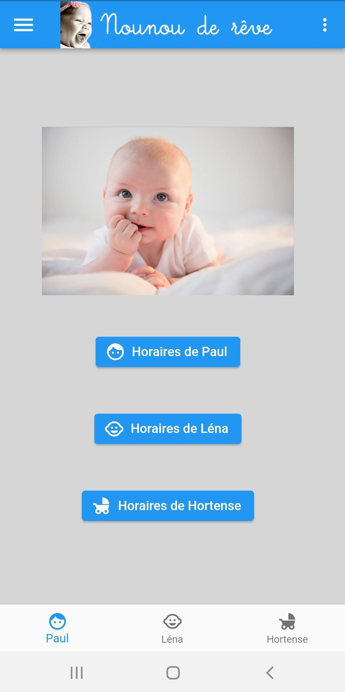
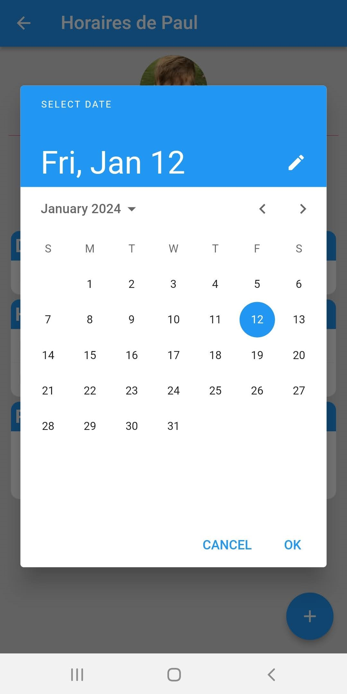
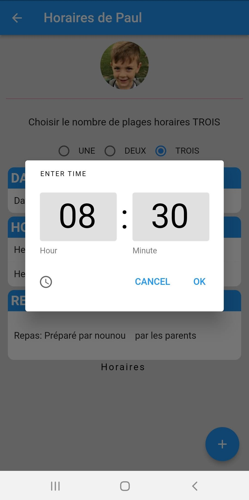
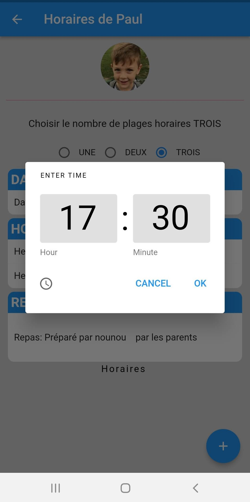
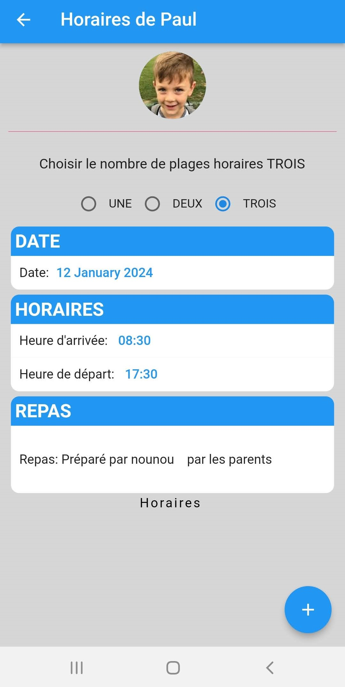

# nounou-de-reve-mobile-App.
This project was developped for my wife which is childminder (nounou in French!)  
The App help her to record/track his working hours.  
She can manage several childrens arriving and leaving every days, at differente hours. 
So to replace his small piece of paper and pen…. I create this mobile app. with Flutter. 

She can select the children from the main page 
  
Input date and time using date picker and time picker  

 

 

Data are loaded into a google sheeet, so quite easy to totalize at the end of the month or make analysis at the end of the year.  

App is working, (not 100% finalized)  
It was my first mobile application, code is not clean and content a lot of personal information, 
 
So it will not be public, but if you have question or if you are interrested by the code, just ask me.

